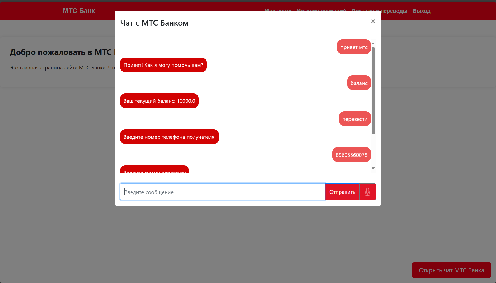

# mts-true-tech-hack - Голосовой помощник для банка

**mts-true-tech-hack** — это голосовой помощник, который упрощает управление банковскими операциями. Приложение позволяет пользователям выполнять финансовые действия с помощью голосовых команд, используя передовые технологии обработки речи.
Реализован в рамках хакатона MtsTrueTech Hack в треке МТС Финтех.
## 📌 Функциональные возможности

### 🔐 Регистрация и авторизация
- **Регистрация**: Пользователь вводит номер телефона и пароль для создания аккаунта.
- **Авторизация**: Происходит через ввод номера телефона и пароль.
- **Безопасность**: Обеспечивается за счет Spring Security.

---

### 🎙 Голосовые операции
- **Проверка баланса счета**:
    - Пользователь может запросить свой текущий баланс голосовой командой.
    - Голосовой помощник возвращает точную сумму, доступную на счету.

- **Переводы средств**:
    - Выполнение переводов по голосовой команде.
    - Поддержка перевода средств другому пользователю по номеру телефона.

- **Оплата счетов**:
    - Голосовая оплата коммунальных услуг (ЖКХ) и других платежей.
    - Платежи реализованы как простое списание средств с основного счета.

---

### 🛠 Технологии
- **Backend**:
    - **Java 17**
    - **Spring Boot**
    - **Spring MVC**
    - **PostgreSQL**

- **Frontend**:
    - **Thymeleaf**
    - **JavaScript**

- **Обработка речи**:
    - **Web Speech API**: Распознает голосовые команды на клиентской стороне и отправляет их на сервер для обработки.
    - Сервер интерпретирует команды и выполняет соответствующие действия.

---

## 🖥 Интерфейс голсового помощника
- Интерфейс представлен в виде простого  чата.
- Пользователь видит:
    - Историю взаимодействия.
    - Ответы голосового помощника.
    - Возможность ввода текста для альтернативного управления.
### Скриншот чата:  


---
## Руководство по развертке и установке решения

### 1. Клонирование репозитория

```
git clone https://github.com/DaniilGrishenok/mts-true-tech-hack.git
```

### 2. Установка и запуск с использованием Docker

Перейдите в директорию проекта:

```
cd mts-true-tech-hack
```
Соберите проект при помощи Maven:
```
mvn clean install

```
Запустите Docker-контейнер:

```
docker-compose up -d
```
# Важно чтобы порт 8090 был не занят!!!
После этого приложение будет доступно по адресу `http://localhost:8090`.

После запуска приложения, чтобы воспользоваться голосовым управлением и другими функциями, необходимо войти в свой аккаунт.

Голосовое управление активируется при открытии чата с помощником. Вы можете открыть его, произнеся фразу «привет МТС» или нажав на кнопку «Открыть чат с МТС Банком».

После открытия чата вы можете использовать следующие команды: «привет МТС», «перевести», «платёж», «баланс».
### Данные для входа тестовых пользователей
Для того чтобы войти в приложение обязательно нужно пройти регистрацию и затем авторизироваться. Для этого предлагаю данные для примера.

- **Номер телефона**: 8123456789
- **Пароль**: password123
